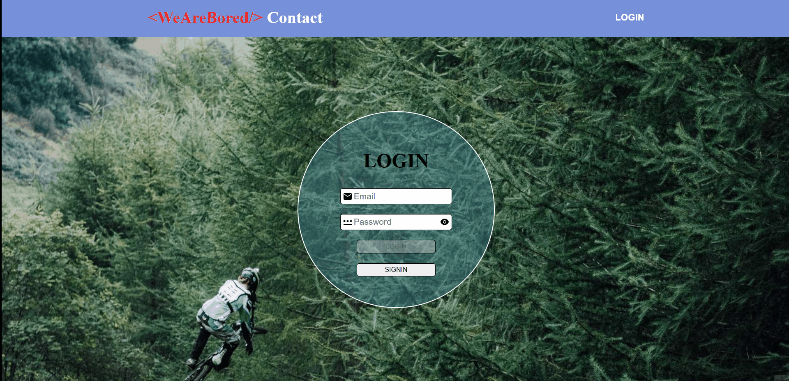

# FireContact App

## Description

Router, redux and firebase contact application created using.

## Tools used in the project

- HTML

- CSS

- JS

- ReactJS

  - Styled Components
  - .map
  - BrowserRouter
  - Route
  - Routes
  - useNavigate
  - Navigate
  - React Icons
  - Outlet
  - useDispatch
  - useSelector
  - useState
  - useEffect
  - 
  - 

- Firebase
  - Authentication
  - Cloud Firestore

<!-- ## Github-pages -->

## Pages

[ Project Website ](https://cosmic-pasca-b88d6c.netlify.app)

## Preview



## Project Skeleton

```
Clarusway Web Page (folder)
|
├── public
|     ├── images
│     └── index.html
|
├── src
│    ├── components
|    │       |
|    |       ├── AddContact
|    │       |     ├── AddContact.jsx
|    │       |     └── addcontact-styled.jsx
|    |       |
|    |       ├── Navbar
|    │       |     ├── Navbar.jsx
|    │       |     └── navbar-styled.jsx
|    │       |
|    │       └── Contacts
|    |             ├── Contacts.jsx
|    |             ├── contacts-styled.jsx
|    │             └── List
|    │                    ├── list-styled.jsx
|    │                    └── List.jsx
|    │
|    ├── private
|    │       ├── action
|    │       |     └── reducerAction.js
|    │       |
|    │       ├── reducers
|    |       |     ├── addcontact.js
|    │       |     └── loginsignin.js
|    │       |
|    │       ├── types
|    │       |     └── reducersType.js
|    │       |
|    │       └── index.js
|    │
|    ├── private
|    │       ├── privateLoginSignin.jsx
|    │       └── PrivateRouter.jsx
|    │
|    ├── pages
|    │       |
|    │       ├── Home
|    │       |     ├── Home.jsx
|    │       |     └── Home-styled.jsx
|    |       |
|    |       ├── Login
|    │       |     ├── login-styled.jsx
|    │       |     └── Login.jsx
|    |       |
|    │       └── Signin
|    │             └── Signin.jsx
|    │
│    ├── firebase.js
│    ├── App.js
│    ├── App.css
│    └── index.js
|
├── .env
├── package.json
├── yarn.lock
└── README.md
```
